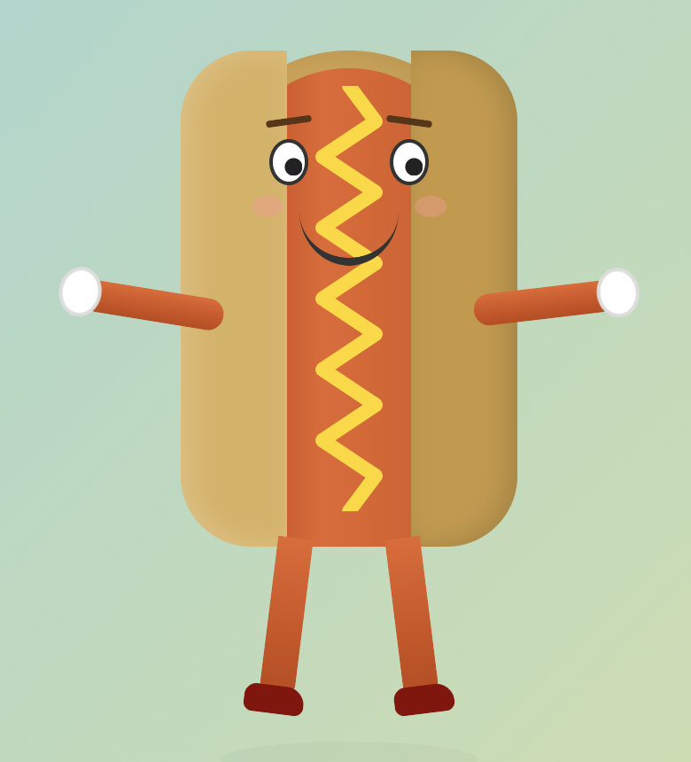

# Hot Dog Man

A fully animated, CSS-powered hot dog person of extraordinary dignity and poise.

**[See him live](https://niznik-dev.github.io/hot-dog-man/)**\*

\*We noticed too late that "see him live" is a perfect homograph. Is he *live*, as in broadcasting right now from a studio in downtown Chicago? Or is he *living*, as in seizing the day, walking boldly into the sun on little red shoes? The answer is yes. He is doing both. He contains multitudes. He is "Hot Dog Man."

## Origin Story

This project was never supposed to exist. It emerged, fully formed, during a routine test of bell notifications in [Claude Code](https://docs.anthropic.com/en/docs/claude-code/overview). One moment we were checking if alerts fired properly. The next, there was a hot dog with googly eyes, a mustard zigzag, and he looked...surprisingly good.

Then someone said, "He needs a top hat." Not a regular hat. Not a baseball cap. A *top hat*. And not just any top hat — one that could only be summoned by pressing a button labeled "Award Hat," because a hot dog of this caliber doesn't just *have* a hat. He *earns* it.

Then it escalated. Someone needed to be able to *award* other people. A printable certificate was drafted. Official timestamps were required — in the timezone that produces the most hot dogs on Earth, naturally. The moon phase had to be recorded for archival integrity. A fact modal about Chicago's hot dog heritage was deemed non-negotiable. At no point did anyone ask "should we stop?"

We do not regret anything.

## Features

- Sesame seed bun with anatomically respectful frank
- Expressive face with wandering eyes and rosy cheeks
- White-gloved hands that wave
- Walking legs in tasteful red shoes
- Classic mustard zigzag
- Rotating hot dog puns in a speech bubble
- A distinguished top hat, bestowed via the **Award Hat** button (he earned it)
- **The Hot Dog Star** — a printable certificate ceremony complete with:
  - Confetti burst
  - Randomized emoji citations
  - Official Hot Dog Man seal
  - Timestamp in **Hot Dog Standard Time** (America/Chicago), with an educational modal about why
  - Current phase of the moon, because of course
- Zero dependencies. Pure HTML/CSS/JS. As nature intended.

## Usage

Open `index.html` in a browser. That's it. That's the whole thing.

## Authors

**Mattie Niznik & Claude** — "It's incredible what we can do."
